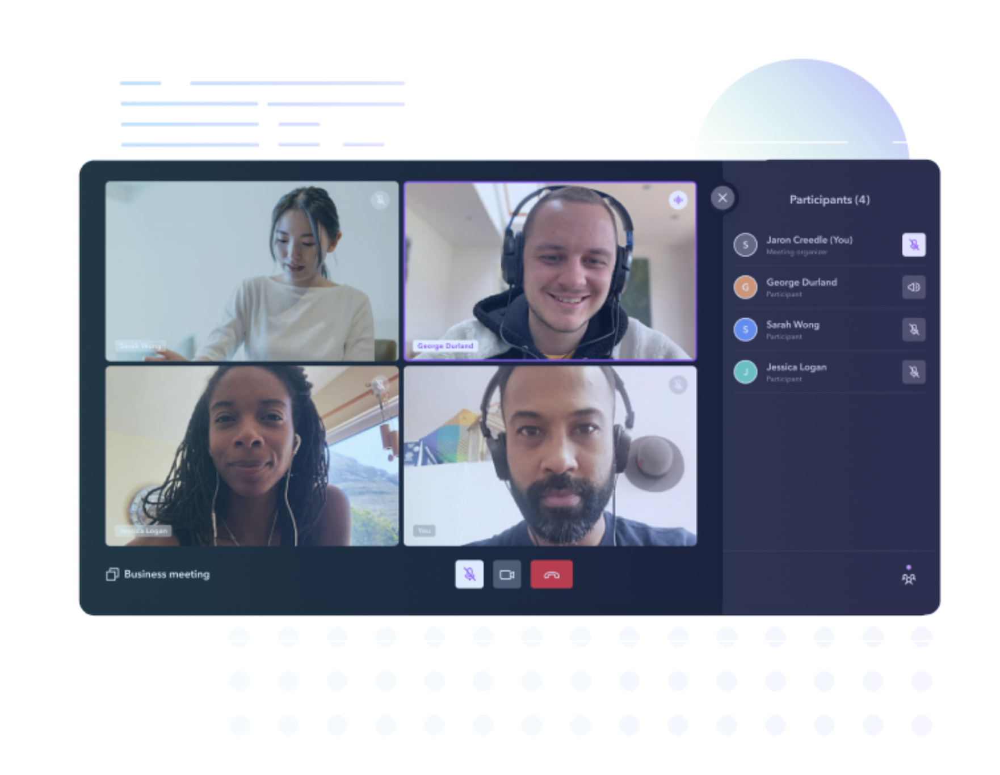
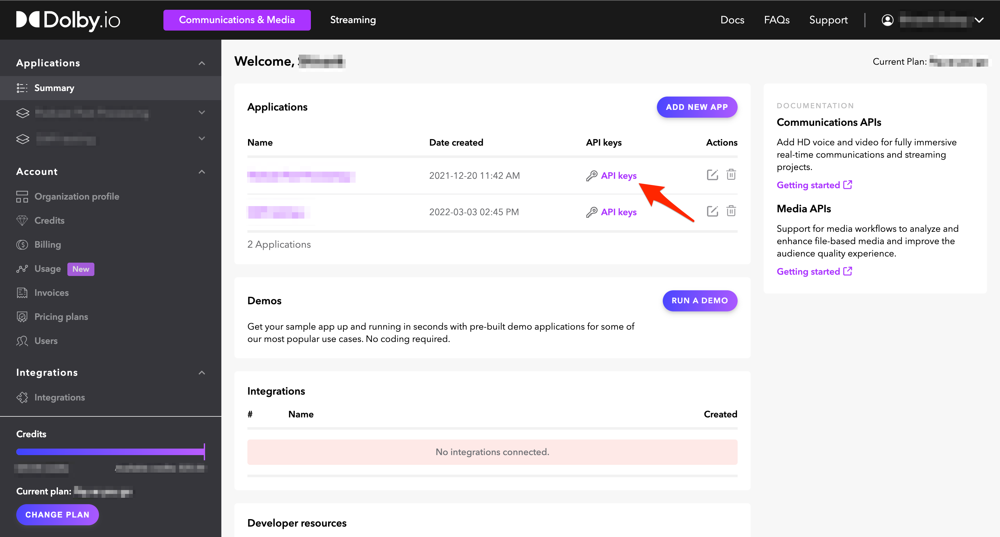
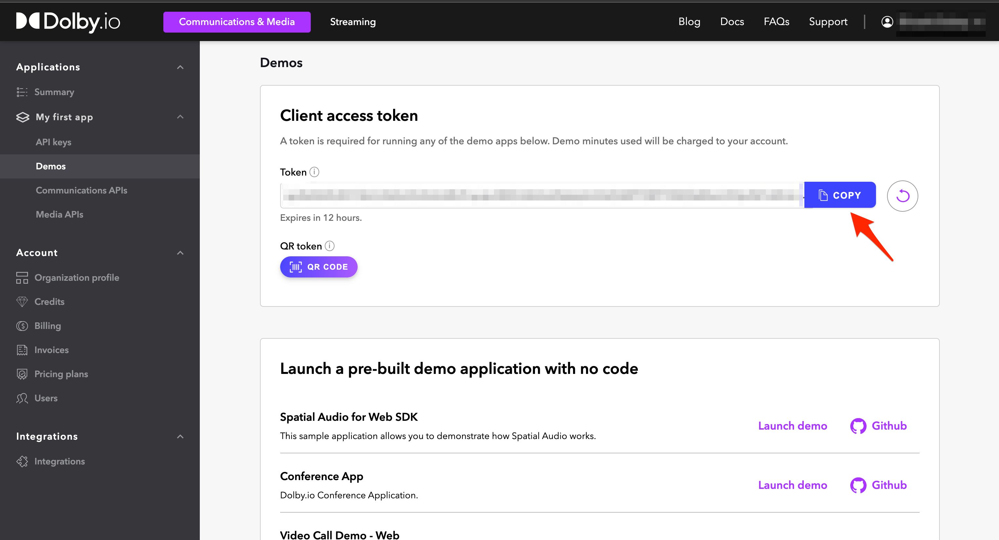

# Video Call App

<p align="center">
  
</p>

## Overview

This project demonstrates what a simple video meeting experience is like, built using React.  

| Intended use | Features                                                         | Tech stack            |
| ------------ | ---------------------------------------------------------------- | --------------------- |
| 1:1 calls    | Creating and joining a conference                                | React                 |
| Group calls  | Camera, microphone, and audio output configuration               | Typescript/Javascript |
| Conferencing | Full conference view with grid display of user streams           | HTML/CSS              |
|              | Basic video conferencing interactions (muting, camera switching) |                       |
|              | Screen sharing                                                   |                       |
|              | Recording                                                        |                       |
|              | Background blur (available only on desktop Chrome and Edge)"     |                       |

Want to learn more? Check out the [Video Call App Project Gallery page](https://docs.dolby.io/communications-apis/docs/video-call).

## Getting Started

The following steps will quickly get you started testing the Dolby.io Communications APIs capabilities.

### Pre-requisites

To get started building this app you will need a Dolby.io account and access token. You will also need the following -  

- NPM v8.11
- Yarn v 1.22.19
- Node v16

### Supported Browsers

The Video Call App supports the following browsers

- Chrome 100+
- Safari 15+
- Firefox 100+
- Edge 100+

#### How to get a Dolby.io account

To setup your Dolby.io account, go to [Dolby.io dashboard](https://dashboard.dolby.io) and complete the form. After confirming your email address, you will be logged in.

#### How to obtain access token

You will need to generate a client access token to run this app. Follow the steps to obtain a token.

1. Go to the Dashboard, and find the _Applications_ menu item..
   

2. On the next screen, there is a token field where you can copy the client access token to your clipboard. The generated token is active for the indicated amount of time.

   

## How to run the Video Conferencing app

Run the following steps after cloning the repository to run the application locally.

### Install dependencies

**note** : This guide is written with [Yarn](https://yarnpkg.com/) in mind.

Open a terminal window in the root directory of your project folder. Install the project's dependencies using the following command.

```bash
yarn
```

### Paste the token

Open file [src/App.tsx](./src/App.tsx), find line 23 and replace `{YOUR_TOKEN}` with your access token string, prepared previously in [this step](#how-to-obtain-access-token). It should look like this:

```javascript
  return (
    <TranslationProvider>
      <ConferenceCreateProvider>
        <CommsProvider token="bGciOiJIUzUxMiJ9.eyJOTQxMywic3V...23r2fsdvsdfsfdsvfd">
          <...>
        </CommsProvider>
      </ConferenceCreateProvider>
    </TranslationProvider>
  );
```

### Start the app

Execute the following command to run the application locally.

```bash
yarn dev
```

### Open the app in a browser

After the appropriate message appears in the terminal window, open <http://localhost:3000> in the browser. The application will launch at this address.

## How to build the Video Conferencing app

Follow the steps of installing dependencies and token configuration from the "How to run the Video Conferencing app" section.

After installing the dependencies, execute the following command:

`yarn build`

This command generates distribution packages in the `/dist` directory.

### Additional configuration

Please see the [additional configuration options](additional-configurations.md) guide to learn more about additional settings such as music mode. 


## More resources 

Looking for more sample apps and projects? Head to the [Project Gallery]()
