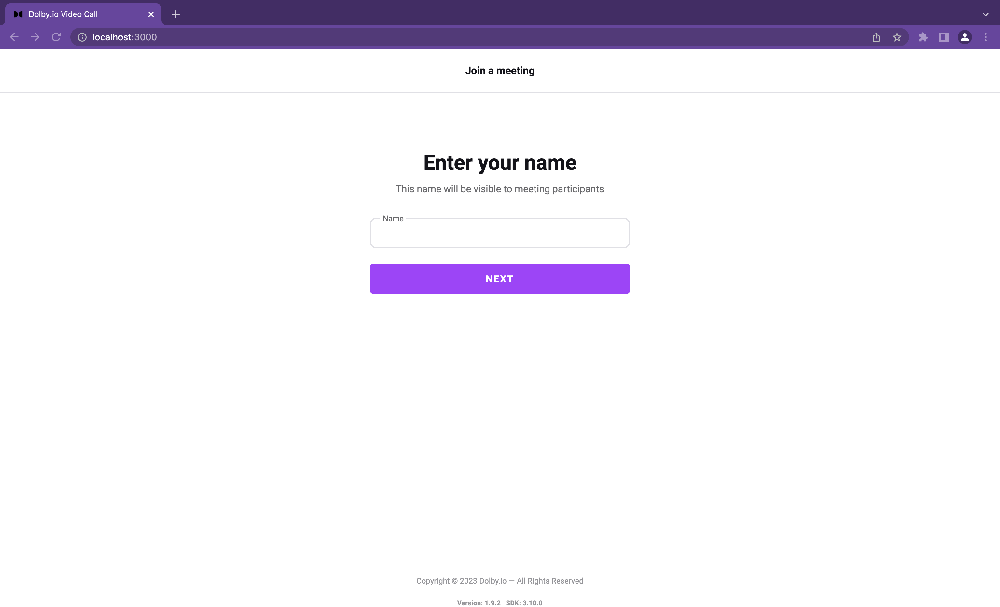

# Video Call App

<p align="center">
  
</p>

## Overview

This project demonstrates what a simple video meeting experience is like, built using React.

| Intended use | Features                                                                                   | Tech stack            |
| ------------ | ------------------------------------------------------------------------------------------ | --------------------- |
| 1:1 calls    | Creating and joining a conference                                                          | React                 |
| Group calls  | Camera, microphone, and audio output configuration                                         | Typescript/Javascript |
| Conferencing | Full conference view with grid display of user streams                                     | HTML/CSS              |
|              | Basic video conferencing interactions (muting, camera switching)                           |                       |
|              | Screen sharing                                                                             |                       |
|              | Recording                                                                                  |                       |
|              | Background blur (available only on desktop Chrome and Edge)                                |                       |
|              | Multi-screen share (maximum 2 instances)                                                   |                       |
|              | Streaming to RTMP endpoints                                                                |                       |
|              | [Music Mode](https://docs.dolby.io/communications-apis/docs/guides-music-mode)             |                       |
|              | [Video Forwarding](https://docs.dolby.io/communications-apis/docs/guides-video-forwarding) |                       |

Want to learn more? Check out the [Video Call App Project Gallery page](https://dolby.io/project-gallery/video-call-sample-apps/).

### Supported Browsers

The Video Call App supports the following browsers

- Chrome 100+
- Safari 15+
- Firefox 100+
- Edge 100+

## Run the demo directly

You can deploy the Dolby.io Video Call app without needing to clone and build the app using the `Deploy to Netlify` button. You will need:

- A Netlify account to which you're logged into
- Your Dolby.io App key and secret

Refer to [this guide](#how-to-get-a-dolbyio-account) on how to obtain your Dolby.io tokens.

[](https://app.netlify.com/start/deploy?repository=https://github.com/dolbyio-samples/comms-app-react-videocall)

## Getting Started

The following steps will quickly get you started testing the Dolby.io Communications Platform.

### Pre-requisites

To get started building this app you will need a Dolby.io account and access token. You will also need the following -

- [Node v18.0.0 or higher](https://nodejs.org/en/download)
- [NPM v8.11 or higher](https://docs.npmjs.com/downloading-and-installing-node-js-and-npm)
- [Yarn v1.22.19](https://classic.yarnpkg.com/lang/en/docs/install/#mac-stable)

### How to get a Dolby.io account

To setup your Dolby.io account, go to [Dolby.io dashboard](https://dashboard.dolby.io) and complete the form. After confirming your email address, you will be logged in.

> If you did not receive a verification email, check your Spam or Junk email folders.

#### Setting up your [Dolby.io](https://dashboard.dolby.io) app

To set up your app, you will need to go to the _Dashboard_. Inside the `Communications and Media` tab, click `Create app` if you do not have an existing app. 

### Repo structure

- The `videocall/src/` directory contains all the front-end code for the video calling app. Within this directory

  - `hooks/` contains wrapper functions around our SDK for re-usable functionality.
  - `components/` contains UI components that encapsulate and provide functionality.
  - `utils/` provides some generic helper functions.
  - `context/` contains the React Context for the side drawer and the main component window.

- The `backend/` contains the code for the proxy server.

This project is built with the [Comms UI Kit for react](https://github.com/dolbyio/comms-uikit-react) library for simplicity and re-use of standard Communications API based components.

### Setup the `.env` file

Create a new file called `.env` in the `videocall` folder, and copy the contents of `.env.example` into it.
You will need to provide the values for `KEY` and `SECRET` from your dolby.io app. To obtain your key and secret from the Dolby.io dashboard,

1. Go to the _Dashboard_, and click on the `API Keys` next to your application.
   
2. On the next screen, copy the `App key` and `App secret` and paste them in your `.env` file against the marked variables.
   

## How to run the Video Conferencing app

Run the following steps after cloning the repository to run the application locally.

### Install dependencies

**note** : This guide is written with [Yarn](https://yarnpkg.com/) in mind.

Open a terminal window in the root directory of your project folder. Install the project's dependencies using the following command.

```bash
yarn
```

### Start the app

Execute the following command to run the application locally.

```bash
yarn dev
```

### Open the app in a browser

After the appropriate message appears in the terminal window, open <http://localhost:3000> in the browser. The application will launch at this address. You should be able to see the welcome screen.



### Additional configuration

Please see the [additional configuration options](additional-configurations.md) guide to learn more about additional settings such as music mode.

## More resources

Looking for more sample apps and projects? Head to the [Project Gallery](https://dolby.io/project-gallery).
